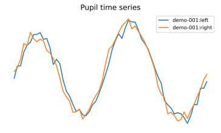
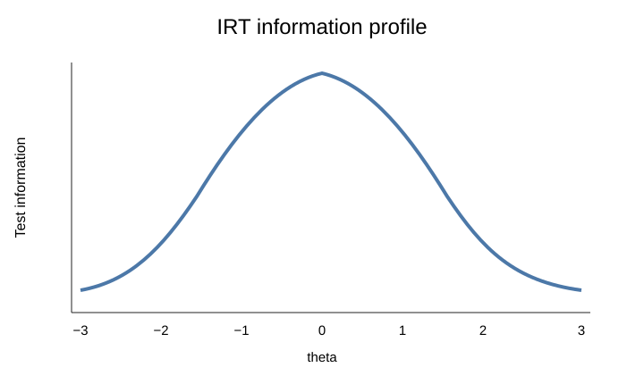

<p align="center">
  
</p>

<h1 align="center">eyeprocesspy</h1>

<p align="center">
  <strong>Reproducible Python infrastructure for eye-tracking, pupillometry, AOIs, process data, psychometrics, and multimodal behavioral measurement.</strong>
</p>

<p align="center">
  <a href="https://stefanosbalaskas.github.io/eyeprocesspy/">Documentation</a> ·
  <a href="https://pypi.org/project/eyeprocesspy/">PyPI</a> ·
  <a href="https://github.com/stefanosbalaskas/eyeprocesspy/releases/tag/v0.1.0">v0.1.0 release</a> ·
  <a href="https://doi.org/10.5281/zenodo.22285167">Zenodo DOI</a> ·
  <a href="https://stefanosbalaskas.github.io/eyeprocesspy/articles/">88 workflow articles</a>
</p>

[](https://github.com/stefanosbalaskas/eyeprocesspy/actions/workflows/ci.yml)
[](https://github.com/stefanosbalaskas/eyeprocesspy/actions/workflows/docs.yml)
[](https://github.com/stefanosbalaskas/eyeprocesspy/actions/workflows/deep-parity-audit.yml)
[](https://pypi.org/project/eyeprocesspy/)
[](https://doi.org/10.5281/zenodo.22285167)
[](IMPLEMENTATION_STATUS.md)
[](RELEASE_VALIDATION.md)
[](https://www.python.org/)
[](docs/parity-and-validation.md)

`eyeprocesspy` is the Python companion and deep-parity port of the R package **eyeprocess**, with frozen **eyeprocess 0.11.1** as the scientific reference. It brings vendor import, canonical data contracts, preprocessing, gaze/AOI analysis, pupil workflows, process measurement, IRT, validation, scientific plots, provenance, and reporting into one auditable package.

> **0.1.0 release evidence:** the controlling deep-parity gate passed with **1,458 tests**, **23,085 / 23,085 statements**, and **9,680 / 9,680 branches** covered. The frozen API and article ledgers are complete, the cross-platform release matrix is green, the package is published on PyPI, and the release is archived on Zenodo as **DOI 10.5281/zenodo.22285167**.

## Release snapshot

| Dimension | Verified state |
| --- | ---: |
| Frozen R public APIs resolved | **1,182 / 1,182** |
| Frozen R reference | **0.11.1** |
| Frozen workflow articles linked | **88 / 88** |
| P4 numerical `not_started` debt | **0** |
| P6 plot `not_started` debt | **0** |
| Full deep-parity tests | **1,458 passed** |
| Statement coverage | **23,085 / 23,085 (100%)** |
| Branch coverage | **9,680 / 9,680 (100%)** |
| CI matrix | **Ubuntu / macOS / Windows × Python 3.11–3.14** |
| PyPI release | **eyeprocesspy 0.1.0** |
| Zenodo archive | **10.5281/zenodo.22285167** |

The exact evidence is recorded in [`RELEASE_VALIDATION.md`](RELEASE_VALIDATION.md) and [`TEST_SUMMARY.md`](TEST_SUMMARY.md).

## Installation

Install the published release from PyPI:

```bash
pip install eyeprocesspy
```

To pin the initial scientific release explicitly:

```bash
pip install eyeprocesspy==0.1.0
```

For development or source installation:

```bash
pip install "git+https://github.com/stefanosbalaskas/eyeprocesspy.git@v0.1.0"
```

### Windows manual installation

The hardened installer has been exercised successfully on a real Windows installation with **Python 3.11.9**. Package verification passed, the recommended extras installed, and `python -m pip check` reported **No broken requirements found**.

From the extracted manual-install bundle:

```powershell
Set-ExecutionPolicy -Scope Process Bypass
.\install_eyeprocesspy.ps1 -WithAllRecommended
```

The installer does **not** require the Windows `py` launcher and can also use an explicitly supplied interpreter path. See the [manual-install guide](https://stefanosbalaskas.github.io/eyeprocesspy/manual-install/).

## Why eyeprocesspy?

- **One coherent data model** for recordings, gaze samples, eye/pupil samples, fixations and episodes, events, intervals, AOIs, responses, features, quality, and provenance.
- **Scientific parity first:** **1,182 / 1,182** frozen APIs are resolved against eyeprocess 0.11.1, with governed records for unavoidable cross-language differences.
- **Process data as first-class evidence:** scanpaths, transitions, temporal structure, uncertainty, reliability, and psychometrics live in the same analytical surface.
- **Measurement guardrails:** calibration uncertainty, quality, reliability, DIF/fairness, and process metrics retain explicit interpretation boundaries.
- **Reproducibility by construction:** deterministic benchmarks, provenance, validation evidence, software-paper evidence, and release audits are built in.
- **Broad scientific plotting surface:** gaze, AOI, pupil, quality, IRT, process-measurement, validation, and model-diagnostic graphics are supported through Matplotlib-oriented workflows.

## Visual tour

| Gaze trace | Scanpath |
| --- | --- |
|  |  |

| Pupil time series | Probabilistic AOI membership |
| --- | --- |
|  |  |

| Process reliability | IRT information |
| --- | --- |
|  |  |

**[Open the complete visual gallery →](https://stefanosbalaskas.github.io/eyeprocesspy/gallery/)**

## 30-second reproducible check

```python
import eyeprocesspy as ep

study = ep.eyeprocess_benchmark_study()
audit = ep.validate_benchmark_study(study)
data = ep.import_benchmark_study(study)

print(audit["valid"])
print(data)
```

For a real export:

```python
import eyeprocesspy as ep

eye = ep.read_eye_export("participant_001.csv", vendor="auto")
issues = ep.validate_eye_dataset(eye)
```

## Capability map

| Area | Representative capabilities |
| --- | --- |
| **Import & canonicalization** | Generic/vendor-aware readers, Gazepoint workflows, schema validation, coordinates, events/timebase, file pairing |
| **Preprocessing & gaze** | Fixations, saccades, dwell, scanpaths, transitions, entropy, recurrence, spatial/process features |
| **AOI uncertainty** | Hard, probabilistic and compositional AOIs; calibration-error propagation and sensitivity |
| **Pupil & multimodal analysis** | Baselines, pupil features, functional pupil, missingness, synchronized streams, staged multimodal models |
| **Psychometrics & IRT** | Foundations, scoring, fit, Q3, DIF/DTF, process-informed/dynamic/advanced IRT, diagnostics |
| **Measurement intelligence** | Reliability, calibration uncertainty, process guardrails, linking, norms, fairness, item-bank optimization |
| **Validation** | Recovery, SBC-style evidence, stress tests, negative controls, grouped/leakage-aware validation, evidence atlases |
| **Reproducibility** | Bundled benchmarks, provenance, manifests, frozen-R oracle, software-paper and release evidence |
| **Plots & reporting** | Publication-oriented plots, validation visualizations, scientific evidence/reporting helpers |

## Documentation

- **Website:** https://stefanosbalaskas.github.io/eyeprocesspy/
- **PyPI:** https://pypi.org/project/eyeprocesspy/
- **GitHub release:** https://github.com/stefanosbalaskas/eyeprocesspy/releases/tag/v0.1.0
- **Zenodo DOI:** https://doi.org/10.5281/zenodo.22285167
- [Getting started](docs/getting-started.md)
- [Manual installation](docs/manual-install.md)
- [Runnable examples](docs/examples/index.md)
- [Practical cookbook](docs/cookbook.md)
- [Visual gallery](docs/gallery.md)
- [Python-native guides](docs/guides/)
- [88-article workflow library](docs/articles/)
- [API and plotting reference](docs/reference/)
- [FAQ](docs/faq.md)
- [Parity and validation](docs/parity-and-validation.md)
- [Release and reproducibility](docs/release-and-reproducibility.md)

## Scientific boundary

`eyeprocesspy` provides **measurement and analysis infrastructure**. A metric is not automatically a validated psychological construct, diagnosis, or causal explanation. Reliability does not establish construct validity; prediction does not establish causation; probabilistic AOI membership reflects modeled coordinate uncertainty rather than probability of attention; and gaze, pupil, and biometric measures require an appropriate design, measurement model, and ethical interpretation.

## Relationship to R eyeprocess

The Python package is developed against the frozen `eyeprocess 0.11.1` reference. API, articles, data, plots, backends, numerical evidence, and unavoidable language-specific divergences are tracked explicitly. Python-native extensions are separated from reference parity so they do not masquerade as R-equivalent behavior.

## Citation

If you use `eyeprocesspy 0.1.0`, cite the archived software release:

> Balaskas, S. (2026). *eyeprocesspy: Vendor-neutral Python infrastructure for eye-tracking and multimodal process data* (Version 0.1.0) [Computer software]. Zenodo. https://doi.org/10.5281/zenodo.22285167

For reproducibility, also report `eyeprocesspy.__version__` and the frozen R reference exposed as `eyeprocesspy.__r_reference_version__`.

## License

See [`LICENSE`](LICENSE).
