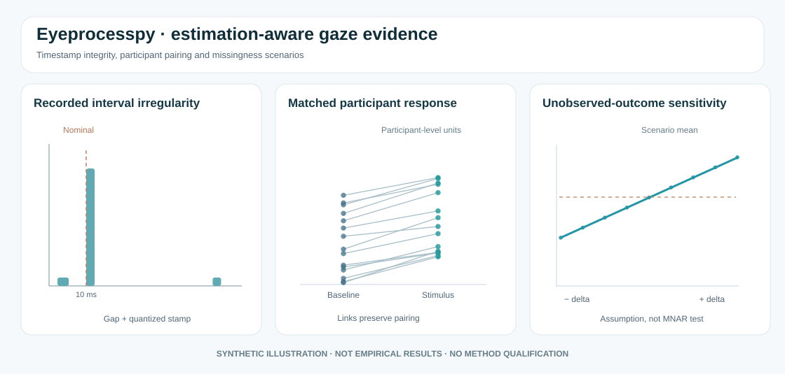

# Estimation-first gaze evidence: an illustrated guide



*Figure. Original synthetic schematics, not graphs from empirical data, fitted models, or released research APIs.*

## 1. What are the recorded samples?

Distinguish **declared hardware-native rate**, **SDK-delivered sampling**, **observed timestamp intervals**, and the **analysis-grid rate**. An interpolated grid cannot create new independent measurements.

```python
import numpy as np
time_s = np.array([0., .01, .02, .03, .03, .04, .094, .095, .105])
dt_ms = np.diff(time_s) * 1000
print({"n_duplicate_intervals": int((dt_ms == 0).sum()),
       "median_positive_hz": 1000 / np.median(dt_ms[dt_ms > 0])})
```

A duplicated timestamp is not proof of a physically duplicated gaze measurement. A long gap alone is not a verified packet-loss count. Neither establishes cross-device synchronization. The experimental audit in [PR #37](https://github.com/stefanosbalaskas/eyeprocesspy/pull/37) is **source-checkout research**, not a stable installed API.

## 2. What is the independent unit in an estimation plot?

[DABEST](https://acclab.github.io/DABEST-python/) popularises displaying raw observations alongside uncertainty about effect size. For within-person gaze experiments, use participant-level paired summaries when the estimand is participant-level; never bootstrap serially correlated frames as independent participants.

```python
import numpy as np
import matplotlib.pyplot as plt

rng = np.random.default_rng(20261009)
n = 30
baseline = rng.normal(.50, .13, n)
stimulus = baseline + rng.normal(.09, .08, n)
fig, ax = plt.subplots(figsize=(6.5, 4))
for before, after in zip(baseline, stimulus):
    ax.plot([0, 1], [before, after], "o-", alpha=.36)
ax.set(xticks=[0, 1], xticklabels=["Baseline", "Stimulus"],
       ylabel="Synthetic participant AOI dwell (seconds)",
       title="Paired participants, not independent gaze frames")
plt.show()
```

This figure deliberately computes no p value. The established [DABEST Python](https://acclab.github.io/DABEST-python/) and [R dabestr](https://acclab.github.io/dabestr/) libraries provide the canonical estimation plots and their implemented uncertainty choices. The R [eyeprocess gallery PR #51](https://github.com/stefanosbalaskas/eyeprocess/pull/51) uses a participant-level resampling demonstration.

## 3. How do unavailable outcome values change an answer?

If the recorded missing fraction is 0.5 and the observed mean equals 11, a user-supplied pattern-mixture scenario has hypothetical mean `11 + 0.5 * delta` under the assumption that missing values average observed mean plus delta.

```python
import numpy as np
delta = np.linspace(-10, 10, 41)
scenario_mean = 11 + 0.5 * delta
```

Delta is unobserved. Multiple complete-data worlds can lead to the **same observed export**. A sensitivity curve does not identify MAR or MNAR. The research branch enforces that interpretation.

## Scientific reporting handoff

Report timestamp behaviour, sample validity, physical target/coordinate calibration, AOI exposure denominator, participant/trial structure, source of uncertainty draws and missingness assumptions **before** interpreting the graphic. A smooth interpolated trajectory cannot compensate for poor sampling, inaccurate calibration or clustered pseudoreplication.

**Status:** synthetic educational gallery. No release or scientific promotion is implied.
