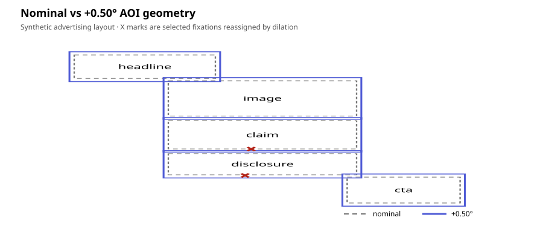
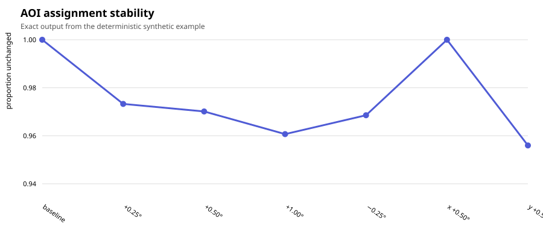
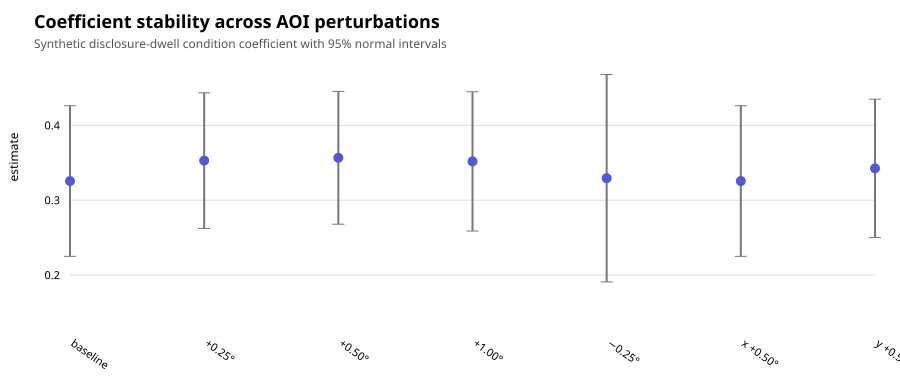
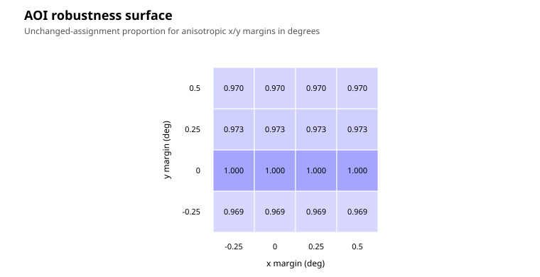

# Worked example: AOI perturbation sensitivity

This fully synthetic example uses a five-region advertising/interface layout:

```text
headline
image
claim
disclosure
CTA
```

The executable source is `examples/aoi_perturbation_sensitivity.py`. No private or empirical participant data are used.

## Perturbation plan

The example evaluates the nominal AOIs plus:

- +0.25° dilation;
- +0.50° dilation;
- +1.00° dilation;
- −0.25° through erosion;
- +0.50° horizontal translation;
- +0.50° vertical translation.

```python
grid = ep.create_aoi_perturbation_grid(
    dilations=[0.25, 0.50, 1.00],
    erosions=[0.25],
    translations_x=[0.50],
    translations_y=[0.50],
    unit="deg",
    screen_width_px=1024,
    screen_height_px=768,
    viewing_distance=60,
    physical_screen_size=(53.1, 29.9),
    boundary_policy="allow",
)
```

## Run assignment, features, and the fixed model callback

```python
result = ep.run_aoi_sensitivity_analysis(
    fixations,
    aois,
    grid,
    x_col="x",
    y_col="y",
    observation_id_col="obs",
    participant_col="participant",
    trial_col="trial",
    duration_col="duration",
    time_col="time",
    overlap_policy="ambiguous",
    model_callback=explicit_ols_callback,
)
```

The same illustrative disclosure-dwell model is used for every branch. The perturbation framework does not select or change the estimator.

## What the example recomputes

- dwell;
- fixation count;
- first fixation;
- disclosure inspection;
- row-level AOI assignments;
- participant/trial/AOI stability;
- coefficient estimates, intervals, direction, and convergence.

## Visual diagnostics

### Geometry and reassigned fixations



### Assignment stability



### Coefficient stability



### Robustness surface




The example produces four plot families:

1. nominal versus perturbed AOIs with reassigned observations;
2. unchanged-assignment trajectories;
3. coefficient trajectories with uncertainty intervals;
4. a two-dimensional anisotropic robustness surface.

## Failure behavior

The test suite also deliberately includes geometry collapse, callback failure, and non-converged model branches. These remain in the audit trail rather than disappearing from the denominator.

!!! note "Synthetic evidence only"
    Numerical values produced by this example validate the software workflow. They are not empirical advertising findings and should not be generalized to real disclosure effects.

## Interpretation

Assignment stability and coefficient stability answer different questions. A result can show many reassigned observations without reversing a coefficient, or show high assignment stability while the model estimate remains sensitive. Report both layers.

Continue with the [methodological guide](../guides/aoi-uncertainty/) and [API reference](../reference/aoi-perturbation.md).