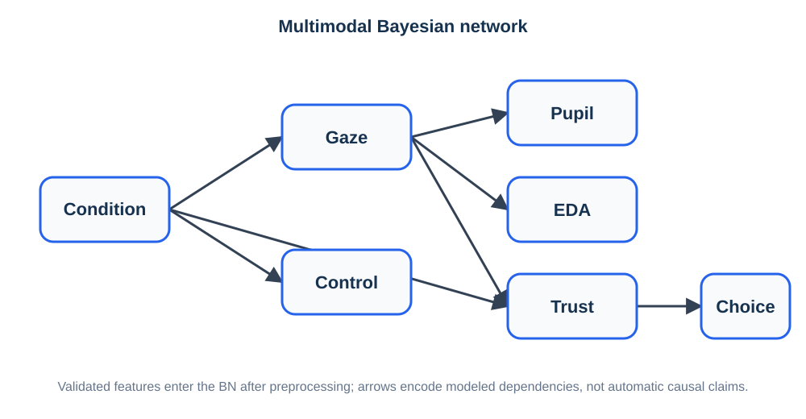
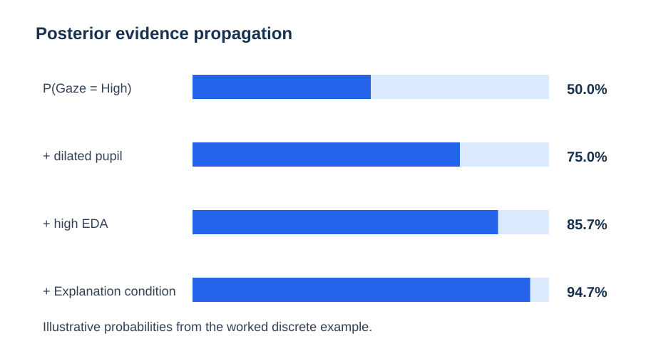

# Multimodal Bayesian-network example

This example uses the package's deterministic teaching network with **Condition, Gaze, Pupil, EDA, Trust, and Choice**. The variables are discrete only so the full probability logic is easy to inspect; this is not a recommendation to dichotomize continuous physiology.

## Generate reproducible demonstration data

~~~python
from eyeprocesspy.bayesian_networks import (
    simulate_multimodal_bayesian_network_example,
    prepare_bayesian_network_data,
    define_bn_constraints,
    learn_bayesian_network,
    fit_bayesian_network,
    query_bayesian_network,
)

data = simulate_multimodal_bayesian_network_example(
    n_participants=1000,
    random_state=2026,
)

bn_data = prepare_bayesian_network_data(
    data,
    nodes={
        "condition": {"type": "categorical", "modality": "experimental"},
        "gaze": {"type": "categorical", "modality": "gaze"},
        "pupil": {"type": "categorical", "modality": "pupil"},
        "eda": {"type": "categorical", "modality": "physiology"},
        "trust": {"type": "categorical", "modality": "questionnaire"},
        "choice": {"type": "categorical", "modality": "behavior"},
    },
    participant_id="participant_id",
    trial_id="trial_id",
)

constraints = define_bn_constraints(
    temporal_tiers=[
        ["condition"],
        ["gaze"],
        ["pupil", "eda"],
        ["trust"],
        ["choice"],
    ],
    nodes=bn_data.structure_nodes,
    max_parents=3,
)
~~~

## Fit a fixed theoretical DAG

~~~python
fitted = fit_bayesian_network(
    [
        ("condition", "gaze"),
        ("gaze", "pupil"),
        ("gaze", "eda"),
        ("condition", "trust"),
        ("gaze", "trust"),
        ("trust", "choice"),
    ],
    data=bn_data,
    estimator="bayesian",
    prior="BDeu",
    equivalent_sample_size=10,
)
~~~

## Query evidence propagation

~~~python
posterior = query_bayesian_network(
    fitted,
    target="trust",
    evidence={
        "condition": "Explanation",
        "pupil": "Dilated",
        "eda": "High",
    },
)

print(posterior.posterior)
~~~

The teaching probabilities were selected so that multimodal evidence raises the probability of high gaze inspection and subsequently high trust. The exact empirical posterior in the simulated dataset varies with sample size and seed because the table is sampled from the network.

## Learn rather than fix the graph

~~~python
learned = learn_bayesian_network(
    bn_data,
    algorithm="hill_climb",
    score="bic",
    constraints=constraints,
)
~~~

Do not read a recovered direction as a causal finding. Compare the learned graph with the known generating DAG using `validate_bayesian_network_recovery()` when doing simulation studies.
