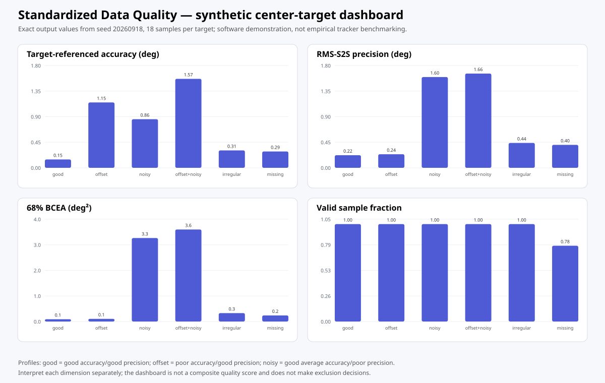
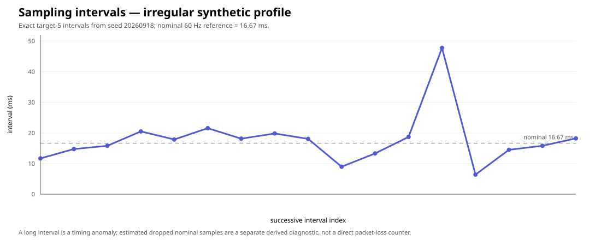

# Data Quality plot gallery

This gallery shows how the standardized quality subsystem should be inspected visually. The figures use deterministic synthetic validation data from `simulate_gaze_quality_calibration(seed=20260918)`; they demonstrate software behavior and are **not** empirical tracker benchmarks.

## Build the same synthetic report

```python
import eyeprocesspy as ep

validation = ep.simulate_gaze_quality_calibration(
    seed=20260918,
    samples_per_target=18,
    nominal_sampling_hz=60,
)

quality = ep.create_gaze_quality_report(
    validation,
    by=["profile", "target_id"],
    valid="valid",
    missing_reason="missing_reason",
    nominal_sampling_hz=60,
    bcea_probability=0.68,
    preprocessing_spec="synthetic raw validation samples; no interpolation",
    quality_rules="descriptive review only",
)

center_target = quality.loc[quality["target_id"].eq(5)].copy()
```

## Dashboard preview



The dashboard deliberately keeps target error, short-term precision, spatial dispersion, and valid-data availability in separate panels. It is not a composite score and does not make an exclusion decision.

Generate the native Matplotlib dashboard with:

```python
fig = ep.plot_gaze_quality_dashboard(center_target)
```

## Target-referenced accuracy

```python
ax = ep.plot_gaze_accuracy(center_target)
```

**Use it for:** validation/check-target periods with known target coordinates.

**Interpretation:** higher error means recorded gaze lies farther from the known target. A stable systematic offset can therefore be precise but inaccurate.

**Do not use it as:** a measure of short-term stability, attention, engagement, or cognitive state.

## RMS sample-to-sample precision

```python
ax = ep.plot_gaze_precision(
    center_target,
    metric="precision_rms_s2s",
)
```

**Use it for:** successive-sample fluctuation during periods in which intended gaze position is stable.

**Interpretation:** larger values mean more adjacent-sample displacement. The implementation never bridges a missing sample.

**Do not use it across:** target changes, intentional saccades, or other periods where true gaze position is expected to move.

## BCEA

```python
ax = ep.plot_bcea(center_target)
```

**Interpretation:** BCEA summarizes spatial spread as an area. The canonical report stores both the area unit and the probability level (`0.68` by default).

**Boundary:** BCEA is not target-referenced accuracy. Report its probability and unit whenever it is used.

## Sampling-interval diagnostic



The preview above shows the exact target-5 inter-sample intervals from the seeded `irregular_sampling` profile.

Generate the corresponding native plot with:

```python
irregular_center = validation.loc[
    validation["profile"].eq("irregular_sampling")
    & validation["target_id"].eq(5)
].copy()

ax = ep.plot_sampling_intervals(
    irregular_center,
    time="timestamp_ms",
    time_unit="ms",
)
```

The nominal 60 Hz period is about 16.67 ms, but nominal frequency alone does not prove a regular realized timebase. When nominal frequency is supplied, the report distinguishes:

- `long_interval_count`: observed intervals exceeding the declared long-gap rule;
- `dropped_interval_count`: estimated missing nominal samples represented by those long gaps.

The second is a timing-derived estimate, not a direct hardware packet-loss counter.

## Review-rule sensitivity

Quality thresholds belong to the analysis protocol, not to the plotting function.

```python
reviewed = ep.create_gaze_quality_report(
    validation,
    by=["profile", "target_id"],
    valid="valid",
    missing_reason="missing_reason",
    nominal_sampling_hz=60,
    thresholds={
        "accuracy_mean": {"max": 1.0},
        "valid_sample_fraction": {"min": 0.80},
    },
)

reviewed[
    ["profile", "target_id", "quality_flags", "review_required"]
]
```

The original rows remain present. Filtering or exclusion, if scientifically justified, is a separate downstream decision. Compare substantive results under plausible pre-specified rules rather than choosing a cutoff after seeing the desired result.

## Suggested manuscript wording

> Eye-tracking data quality was characterized using target-referenced Euclidean accuracy, RMS sample-to-sample and spatial-SD precision, and 68% BCEA. Nominal sampling frequency was supplemented by timestamp-derived effective frequency and inter-sample diagnostics. Missing or explicitly invalid gaze was summarized by valid-data fraction, loss fraction, and loss-run duration. Pre-specified thresholds generated review flags rather than automatic exclusions, and sensitivity analyses evaluated whether substantive conclusions depended on quality decisions.

Adapt the sentence to the metrics actually used; do not report measures that were not computed.

The compact package-generated summary can be used as a reproducible starting point:

```python
print(ep.report_gaze_quality(center_target))
```

## Limitations

These plots characterize the **measurement process**. They do not establish psychological attention, engagement, cognitive load, motivation, competence, or clinical status. Synthetic profiles validate software behavior and illustrate interpretation; they do not establish universal device-performance expectations or universal exclusion thresholds.

## Continue

- [Data Quality overview and equations](../guides/data-quality.md)
- [Worked 9-point validation](data-quality-validation.md)
- [Quality-rule sensitivity](data-quality-sensitivity.md)
- [Reporting guideline](../guides/data-quality-reporting.md)
- [Focused Data Quality API](../reference/data-quality.md)
- [Complete API reference](../reference/api.md)
