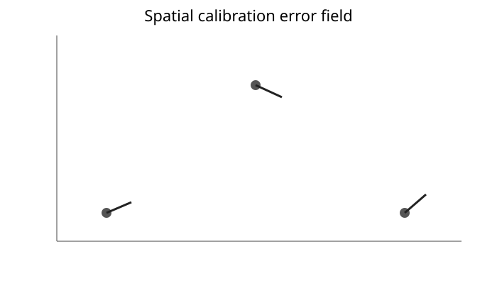
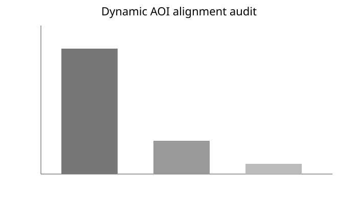
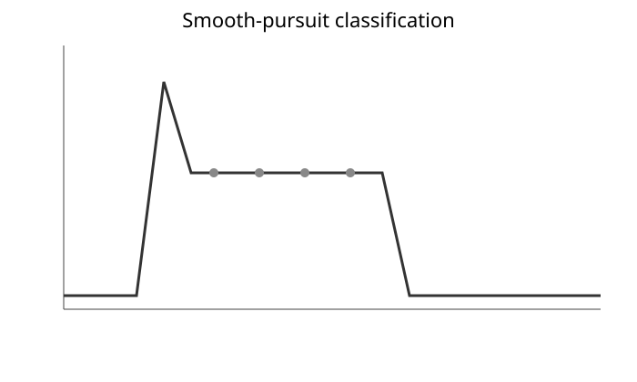
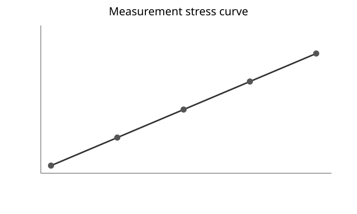

# Worked example: measurement validity and dynamic gaze

This compact synthetic example demonstrates the new workflow without private participant data.

~~~python
import numpy as np
import pandas as pd
import eyeprocesspy as ep

rng = np.random.default_rng(20260927)

validation = pd.DataFrame({
    "target_id": np.repeat(["A", "B", "C"], 20),
    "target_x": np.repeat([0.0, 1.0, 2.0], 20),
    "target_y": np.repeat([0.0, 1.0, 0.0], 20),
    "pupil": rng.normal(3.5, 0.2, 60),
})
validation["gaze_x"] = validation["target_x"] + 0.10 + 0.04 * (
    validation["pupil"] - validation["pupil"].mean()
) + rng.normal(0, 0.02, 60)
validation["gaze_y"] = validation["target_y"] - 0.05 - 0.02 * (
    validation["pupil"] - validation["pupil"].mean()
) + rng.normal(0, 0.02, 60)

field = ep.compute_spatial_error_field(validation, target_id="target_id")
pupil_artifact = ep.fit_pupil_size_artifact(validation)
~~~

The calibration field should be inspected for target coverage rather than applied automatically. Pupil-size correction should be estimated on target-referenced data, not on free-viewing gaze.

The figures are deterministic synthetic demonstrations of package outputs. They are not empirical findings.
