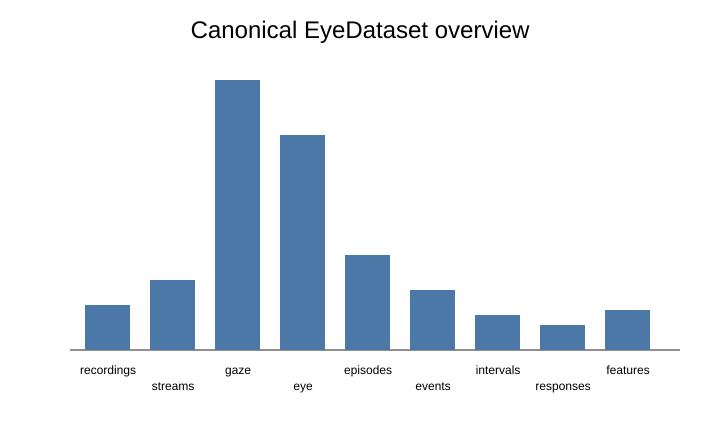

# Visual gallery

The previews on this page summarize deterministic `eyeprocesspy 0.1.0` example outputs. Run `python examples/core_gallery.py` and `python examples/advanced_gallery.py` to generate the full Matplotlib figures directly through the package plotting API. The scripts were validated against the CI-built wheel and use no private participant data.

## Gaze, fixation and AOI workflows

<figure>
  
  <figcaption><strong>Gaze trace.</strong> Ordered valid gaze samples in canonical coordinates.</figcaption>
</figure>

<figure>
  
  <figcaption><strong>Fixations.</strong> Duration-scaled fixation centroids.</figcaption>
</figure>

<figure>
  
  <figcaption><strong>Scanpath.</strong> Ordered AOI visits with spatial trajectory.</figcaption>
</figure>

<figure>
  
  <figcaption><strong>Gaze density.</strong> Two-dimensional histogram over gaze coordinates.</figcaption>
</figure>

<figure>
  
  <figcaption><strong>AOI dwell.</strong> AOI-level dwell features carried in the canonical feature table.</figcaption>
</figure>

<figure>
  
  <figcaption><strong>Transition matrix.</strong> Row-normalized transitions derived from scanpath episodes.</figcaption>
</figure>

## AOI uncertainty and robustness

These diagnostics come from the synthetic AOI perturbation workflow. Read them together: geometry explains **what changed**, assignment stability quantifies **how much changed**, coefficient stability shows **whether inference moved**, and the robustness surface shows **where sensitivity concentrates across two-dimensional boundary changes**.

<figure>
  
  <figcaption><strong>Geometry perturbation.</strong> Compare nominal and perturbed boundaries and inspect observations that cross an AOI decision boundary.</figcaption>
</figure>

<figure>
  
  <figcaption><strong>Assignment stability.</strong> Summarize unchanged, newly assigned, lost, and reassigned observations across declared branches.</figcaption>
</figure>

<figure>
  
  <figcaption><strong>Coefficient stability.</strong> Inspect effect magnitude and intervals across evaluable branches instead of reducing robustness to significance counts.</figcaption>
</figure>

<figure>
  
  <figcaption><strong>Robustness surface.</strong> Locate regions of higher or lower stability when horizontal and vertical geometry changes are varied jointly.</figcaption>
</figure>

[Open the AOI uncertainty workflow →](guides/aoi-uncertainty/)

## Time-to-event gaze workflows

<figure>
  
  <figcaption><strong>Censored gaze latency.</strong> Kaplan–Meier curves retain valid trials that end before the target AOI is inspected.</figcaption>
</figure>

[Open the survival-analysis method →](methods/gaze-survival/index.md)

## Pupil and data-quality workflows

<figure>
  
  <figcaption><strong>Pupil time series.</strong> Eye-specific pupil streams on a shared timebase.</figcaption>
</figure>

<figure>
  
  <figcaption><strong>Sampling irregularity.</strong> Effective sampling diagnostics with an explicit review threshold.</figcaption>
</figure>

<figure>
  
  <figcaption><strong>Calibration error.</strong> Empirical horizontal/vertical error cloud used to propagate gaze uncertainty.</figcaption>
</figure>

<figure>
  
  <figcaption><strong>Probabilistic AOIs.</strong> Membership probabilities after calibration uncertainty is propagated.</figcaption>
</figure>

## Psychometrics and measurement

<figure>
  
  <figcaption><strong>Process reliability.</strong> Bland–Altman diagnostics for repeated process measures.</figcaption>
</figure>

<figure>
  
  <figcaption><strong>IRT information.</strong> Test information across the latent continuum.</figcaption>
</figure>

<figure>
  
  <figcaption><strong>IRT item fit.</strong> Item-level fit diagnostics against the reference line.</figcaption>
</figure>

<figure>
  
  <figcaption><strong>DIF curve.</strong> Signed focal-reference probability difference across theta.</figcaption>
</figure>

## Dataset overview

The plotting functions retain the underlying plot data on the Matplotlib axes where relevant (`ax.eyeprocess_plot_data`, and for matrix plots `ax.eyeprocess_plot_matrix`). This makes the visual output auditable and allows publication styling without losing the numerical payload.

!!! note "Scientific interpretation"
    The gallery demonstrates computational capabilities. A gaze, pupil, reliability, or psychometric statistic is not automatically a validated psychological construct. Use the package's evidence, provenance, and guardrail layers alongside an appropriate study design.
