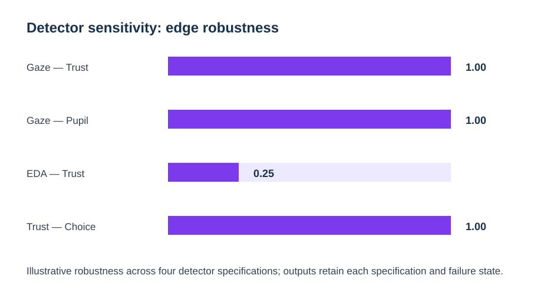

# Detector and AOI sensitivity

General BN packages do not know that a fixation count depends on an event detector or that an AOI-derived dwell measure depends on geometry. `eyeprocesspy` can preserve those upstream specifications and compare the resulting networks.

## Event-detector multiverse

~~~python
from eyeprocesspy.bayesian_networks import compare_bn_across_detectors

comparison = compare_bn_across_detectors(
    {
        "ivt": ivt_bn_data,
        "idt": idt_bn_data,
        "adaptive_velocity": adaptive_bn_data,
        "remodnav": remodnav_bn_data,
    },
    constraints=constraints,
)
~~~

The output records, for each undirected relation, the direction or absence in every detector specification plus `edge_robustness`, the fraction of specifications containing the relation.

## AOI sensitivity

Use `compare_bn_across_aoi_specs()` with feature tables generated under prespecified AOI perturbations. This does **not** recompute AOIs inside the BN layer; AOI perturbation remains an upstream analysis.

## What stability means

Stability across detectors/AOIs supports a claim that the network conclusion is not uniquely dependent on one defensible preprocessing specification. It does not prove the edge is causal or universally valid.
