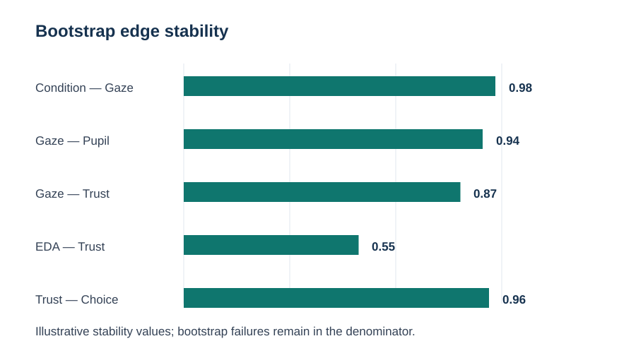

# Stability and participant-aware validation

A single learned DAG should not be treated as ground truth.

## Bootstrap the structure

~~~python
from eyeprocesspy.bayesian_networks import bootstrap_bn_structure

stability = bootstrap_bn_structure(
    bn_data,
    constraints=constraints,
    n_boot=1000,
    resample_by="participant_id",
    random_state=2026,
)

print(stability.edge_table)
~~~

`edge_strength` is the fraction of **planned bootstrap replications** in which the undirected relationship appears. Failed fits remain in the denominator. `direction_strength` is conditional on the edge being present.

When multiple trials come from each participant, participant resampling is recommended. If `participant_id` is declared and repeated, `bootstrap_bn_structure()` selects participant-level resampling automatically unless overridden.

## Grouped cross-validation

~~~python
from eyeprocesspy.bayesian_networks import validate_bayesian_network

cv = validate_bayesian_network(
    bn_data,
    constraints=constraints,
    method="group_kfold",
    groups="participant_id",
    n_splits=10,
    estimator="bayesian",
)
~~~

Structure learning and parameter fitting occur **inside each training fold**. A participant never contributes some trials to training and other trials to its held-out fold.

Validation reports held-out log likelihood and retains fold failures explicitly instead of silently discarding them.
