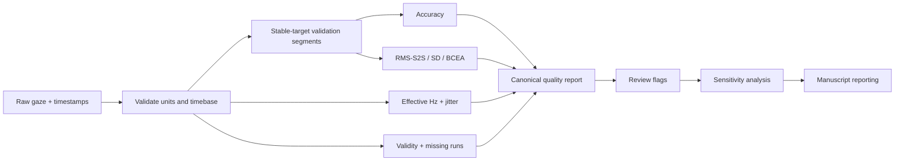
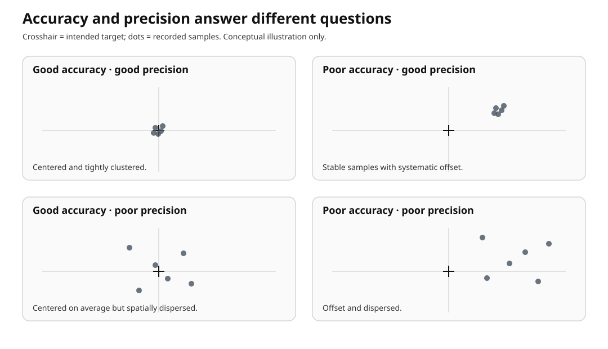

# Data Quality

Eye-tracking data quality is multidimensional. This guide keeps **accuracy**, **precision**, **sampling stability**, and **data availability** separate so a convenient dashboard cannot obscure the measurement process.

!!! important
    No default threshold excludes a participant, trial, or sample. User-supplied thresholds create review flags only. Units are never mixed or converted implicitly.

## Workflow



## Accuracy versus precision

Accuracy is the distance between recorded and known target position. Precision describes reproducibility while the intended gaze position is stable. A constant offset therefore has poor accuracy but can have excellent precision; centered noise can show the opposite pattern.



*Conceptual illustration, not empirical data. The target is fixed at the crosshair while sample location and spread vary independently.*

```python
import eyeprocesspy as ep

data = ep.simulate_gaze_quality_calibration(samples_per_target=8)
report = ep.create_gaze_quality_report(
    data,
    by=["profile", "target_id"],
    valid="valid",
    missing_reason="missing_reason",
    nominal_sampling_hz=60,
)
```

## RMS-S2S precision

For adjacent valid samples,

\[
\mathrm{RMS\text{-}S2S}=\sqrt{\frac{1}{K}\sum_i
[(x_{i+1}-x_i)^2+(y_{i+1}-y_i)^2]}.
\]

`compute_rms_s2s()` never bridges across a missing sample. Use `max_gap_ms` only when your protocol defines a maximum defensible pairwise interval; the value is preserved in provenance.

**Use it for:** short-term sample-to-sample fluctuation during stable gaze.

**Do not use it for:** sequences spanning target changes, saccades, or other intentional gaze movement.

## Standard-deviation precision

`compute_gaze_sd_precision()` describes the spatial spread of gaze around a stable location using the population SD convention used in the data-quality guidance (denominator `n`). It is complementary to RMS-S2S, not a substitute for it.

## BCEA

\[
\mathrm{BCEA}=2\pi k\sigma_x\sigma_y\sqrt{1-\rho^2},\qquad
k=-\log(1-p).
\]

The probability is explicit (`probability=0.68` by default) and the area unit is reported (`deg^2`, `px^2`, or `normalized^2`).

## Effective versus nominal sampling rate

A hardware label is not an empirical timebase audit. `estimate_effective_sampling_rate()` reports observed timestamp count, the sample count used for effective-Hz estimation, timestamp span, an estimated recording duration (span plus one median positive interval), effective Hz, and median interval. When nominal Hz is supplied it reports both `long_interval_count` (how many positive intervals exceeded the declared multiple of the nominal interval) and `dropped_interval_count` (the estimated number of missing nominal samples represented by those long gaps). When gaze coordinates/validity are supplied, effective Hz uses valid gaze samples with finite timestamps; otherwise it describes the timestamp stream. `estimate_sampling_interval()` also exposes duplicate and non-monotonic timestamps, while `estimate_sampling_jitter()` summarizes interval variability.

## Data loss and missingness

`compute_gaze_data_loss()` reports valid, invalid, and missing fractions; number and duration of loss runs; and, when supplied, reason-specific fractions such as blink or tracker invalidity. Missing gaze is never converted to zero.

## Units

Supported coordinate units are `degrees`, `pixels`, and `normalized`. Conversion requires an explicit `output_unit` plus screen geometry:

```python
geometry = {
    "screen_width_px": 1920,
    "screen_height_px": 1080,
    "screen_width_cm": 53.0,
    "screen_height_cm": 29.8,
    "viewing_distance_cm": 60.0,
}
accuracy_deg = ep.compute_gaze_accuracy(
    pixel_validation,
    unit="pixels",
    output_unit="degrees",
    geometry=geometry,
)
```

No conversion occurs merely because geometry is present.

## Interpretation boundaries

Do not interpret a quality metric as attention, cognition, motivation, competence, or clinical status. Quality metrics characterize the measurement process. Likewise, a review flag is not an automatic exclusion decision.

## Next steps

- [Worked 9-point validation example](../examples/data-quality-validation.md)
- [Data-quality reporting guideline](data-quality-reporting.md)
- [Focused Data Quality API](../reference/data-quality.md)\n- [Complete API reference](../reference/api.md)
