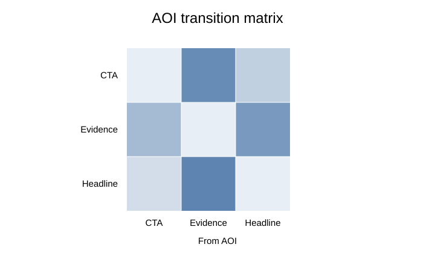

# End-to-end eye-tracking workflow

A defensible eye-tracking workflow is not just `read → calculate → model`. `eyeprocesspy` is structured around an explicit sequence: **import → canonicalize → validate → audit measurement conditions → derive process features → visualize → model → preserve evidence**.

## 1. Import into the canonical model

```python
import eyeprocesspy as ep

eye = ep.read_eye_export("participant_001.csv", vendor="auto")
```

When a folder contains multiple files, prefer `read_eye_folder()` or a vendor-specific workflow over manual concatenation so file-level provenance and pairing decisions are not lost.

## 2. Validate the dataset contract

```python
issues = ep.validate_eye_dataset(eye)
print(issues)
```

An empty error table means the canonical structure is coherent. It does **not** prove that calibration, sampling, preprocessing, tasks, AOIs, or measurement choices are scientifically valid.

## 3. Audit measurement conditions

```python
readiness = ep.analysis_readiness(eye)
rates = ep.audit_sampling_rate(eye)
missing = ep.audit_missingness(eye)
spaces = ep.audit_coordinate_spaces(eye)
```

Before inferential modeling, make the following explicit:

- coordinate system and screen/media geometry;
- normalized vs pixel coordinates;
- timebase and event alignment;
- empirical/effective sampling rate;
- gaze validity and missingness rules;
- calibration or validation quality where available;
- trial definitions and exclusions;
- whether features are sample-, episode-, AOI-, trial-, item-, person-, session-, or recording-level.

## 4. Inspect the raw spatial process

```python
ax = ep.plot_eye_trace(eye, trial_id="T1")
ax.figure.tight_layout()

ax = ep.plot_gaze_heatmap(eye, trial_id="T1", bins=(40, 30))
ax.figure.tight_layout()
```


A visual diagnostic is not a substitute for QC, but it is often the fastest way to detect coordinate reversal, unexpected clipping, missing trials, or event-selection mistakes.

## 5. Inspect fixation and scanpath structure

```python
ax = ep.plot_fixations(eye, trial_id="T1")
ax.figure.tight_layout()

ax = ep.plot_scanpath(eye, trial_id="T1")
ax.figure.tight_layout()
```


Sequence structure can contain information that disappears after aggregation to total dwell or fixation count.

## 6. Derive AOI sequences and transitions

```python
sequence = ep.scanpath_sequence(
    eye,
    source="visits",
    collapse_consecutive=True,
)

matrix = ep.transition_matrix(
    eye,
    source="visits",
    normalize="row",
)

print(sequence)
print(matrix)
```



When interpreting transitions, document whether the source is AOI visits, fixation episodes, or sample-level assignments and whether consecutive self-states were collapsed.

## 7. Inspect pupil streams separately from gaze

```python
ax = ep.plot_pupil_timeseries(eye, trial_id="T1")
ax.figure.tight_layout()
```


Pupil measurements have their own validity, blink, missingness, interpolation, baseline, and time-alignment assumptions. They should not inherit gaze preprocessing decisions automatically.

## 8. Quantify quality before modeling

Use quality functions appropriate to the design rather than a single composite QC score. Depending on the data, this can include sampling audits, missingness, calibration error, gaze precision, process reliability, and sensitivity to exclusions or preprocessing.

## 9. Preserve provenance

```python
manifest = ep.provenance_manifest(eye)
```

A reproducible analysis should preserve at least:

- exact package version/commit;
- source files and hashes where available;
- import/vendor decisions;
- coordinate definitions;
- time/event alignment;
- preprocessing and exclusions;
- feature definitions and levels;
- quality/validation evidence;
- statistical model specification.

## 10. Model after the measurement pipeline is defensible

Mixed models, SEM, Bayesian models, ML, IRT, and sequence models cannot repair an undocumented observation pipeline. Treat aggregation and feature engineering as measurement decisions, not neutral formatting.

## Next steps

- [Gazepoint import and QC](gazepoint-import-qc.md)
- [Pupillometry](pupillometry.md)
- [Process quality and uncertainty](process-quality-uncertainty.md)
- [Psychometrics and IRT](psychometrics-irt.md)
- [Reproducibility and release evidence](reproducibility-release-evidence.md)
