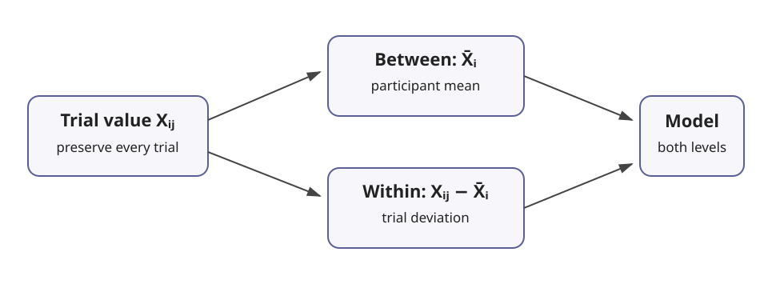

# Trial-level multilevel gaze mediation

## Method overview

Use this workflow when the scientific question is expressed at the trial level, for example:

> AI correctness → source inspection → override decision

or:

> disclosure → disclosure dwell → trust → reliance

The preparation layer belongs in **eyeprocesspy**. It preserves the repeated-measures structure, decomposes trial-varying variables into within- and between-participant components, audits missingness and trial support, and carries provenance into the downstream model. It does **not** fit a Bayesian mediation model.

## Why not aggregate first?

A participant mean combines two distinct sources of information: trial-to-trial deviations within a person and stable differences between people. The resulting single-level path can therefore answer a different question from the trial-level process that generated the data. `prepare_multilevel_mediation_data()` keeps both components explicit:

```text
X_within  = X_ij - mean_i(X)
X_between = mean_i(X)
M_within  = M_ij - mean_i(M)
M_between = mean_i(M)
```

By default the between component is the participant mean itself. Grand-mean centering is available but must be requested explicitly.

## When to use

Use trial-level mediation when the exposure/manipulation or mediator varies across repeated trials, the temporal ordering is defensible, and the substantive estimand concerns within-person trial-to-trial processes. It is especially useful when gaze is one link in a behavioral mechanism rather than merely a participant-level trait proxy.

## When not to use

Do not use this workflow merely because multiple trials are available. Avoid a mediation interpretation when the mediator is recorded after the outcome, the exposure is not plausibly prior to the mediator, the design cannot distinguish within- and between-person variation, or missing gaze is so structurally informative that complete-case modeling is not defensible. A significant product of coefficients does not repair a weak causal design.

## Core preparation API

```python
from eyeprocesspy import prepare_multilevel_mediation_data

prepared = prepare_multilevel_mediation_data(
    trials,
    x_col="ai_correct",
    mediator_col="source_dwell",
    outcome_col="correct_override",
    participant_col="participant_id",
    trial_col="trial_id",
    quality_col="valid_fraction",
    minimum_quality=0.80,
    quality_action="flag",
    source_id="ai-advice-study",
    preprocessing_spec={"blink_policy": "flag"},
    event_detector={"algorithm": "I-VT", "velocity_threshold": 30},
    aoi_specification={"source": "registered-study-aoi-v2"},
)
```

No row is silently removed. `mediation_analysis_eligible` identifies rows that satisfy the declared observation and quality rules; choosing whether to exclude them is a later, explicit modeling decision.

## Observation-state semantics

The output distinguishes four mediator states:

| State | Meaning |
|---|---|
| `observed_nonzero` | mediator was observed and non-zero |
| `observed_zero` | a genuine observed zero |
| `not_observed` | mediator was not observed |
| `poor_quality` | trial failed the declared quality rule |

A missing gaze mediator is never converted to zero. If `quality_action="mask_mediator"` is used, masking is explicit, preserved in provenance, and rows remain in the prepared object.

## Serial mediators and moderators

Keep decomposition in eyeprocesspy:

```python
from eyeprocesspy import add_multilevel_mediation_component

prepared = add_multilevel_mediation_component(
    prepared,
    value_col="trust",
    semantic="mediator2",
    within_col="M2_within",
    between_col="M2_between",
)
```

The same helper can prepare a moderator using `semantic="moderator"`, `within_col="Z_within"`, and `between_col="Z_between"`. Bayesian backends consume these columns but do not recreate them.

## Quality and failure cases

The preparation function fails rather than guessing when participant/trial keys are duplicated, required variables are non-numeric, or a required within-person exposure has no within-participant variation. Singleton participants are retained and flagged. Unbalanced trials are retained and summarized.

## Provenance

Prepared objects carry source identity/fingerprint, preprocessing specification, detector details, AOI specification, quality rules, decomposition settings, missingness policy, and package version where supplied. This metadata is intended to travel with the downstream Bayesian model.


## Visual example



The figure uses synthetic data and illustrates the preparation estimand: both axes are participant-centered trial deviations, not participant means. The regression line is descriptive and is **not** a fitted mediation model.

## Guide map

- [Design and preparation decision guide](decision-guide.md)
- [Why participant aggregation can mislead](why-aggregation-can-mislead.md)
- [Preparing trial-level gaze mediators](preparing-gaze-mediators.md)
- [Missingness, quality, and trial retention](missingness-and-quality.md)
- [Pre-fit analysis readiness checklist](analysis-readiness-checklist.md)

## Next step

Pass the prepared object to `gp3bayespy.specify_multilevel_gaze_mediation()` or `gp3bayespy.fit_multilevel_gaze_mediation()`. Do not manually reconstruct `X_within`, `X_between`, `M_within`, or `M_between` in the modeling package.


## Runnable examples

The repository example `examples/multilevel_mediation_preparation.py` is intentionally small enough for CI. It demonstrates genuine zero gaze, missing gaze, a poor-quality trial, within/between decomposition, and the resulting audits without fitting a model.
