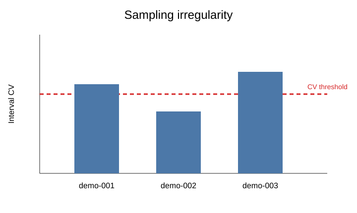
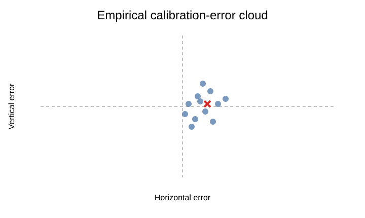

# Process quality, reliability, and calibration uncertainty

`eyeprocesspy` treats data quality and measurement uncertainty as explicit analysis objects. Rather than collapsing everything into one QC score, it provides separate tools for reliability, sampling regularity, calibration error, gaze precision, data quality, and uncertainty-aware AOI assignment.

## Process reliability

For repeated process measures across sessions:

```python
profile = ep.process_reliability_profile(
    data,
    person="person",
    session="session",
    measure="dwell_score",
)

print(profile["icc"])
print(profile["bland_altman"]["summary"])
```

Visualize the repeated-measure agreement:

```python
ax = ep.plot_eye_process_reliability_profile(profile)
ax.figure.tight_layout()
```


The package also exposes split-half, ICC, Bland–Altman, temporal-stability, and bootstrap reliability helpers.

### Reliability is not validity

A highly repeatable metric can still measure the wrong construct. Reliability depends on population, design, session structure, preprocessing, and feature definition. Use it as measurement evidence, not as proof of construct validity.

## Sampling irregularity

Timestamp-based quality can be audited directly:

```python
audit = ep.audit_sampling_irregularity(
    samples,
    time="timestamp_ms",
    unit="ms",
    by="recording_id",
    cv_threshold=0.05,
)
```

```python
ax = ep.plot_eye_sampling_irregularity_audit(audit)
```



A threshold is a workflow-specific review rule, not a universal definition of acceptable eye-tracking data.

## Effective sampling frequency and gaze precision

```python
hz = ep.effective_sampling_frequency(
    samples,
    time="timestamp_ms",
    unit="ms",
    by="recording_id",
)

precision = ep.gaze_precision_rms_s2s(
    samples,
    x="gaze_x",
    y="gaze_y",
    time="timestamp_ms",
    by="recording_id",
)
```

Nominal device frequency and empirical effective frequency should not be treated as interchangeable.

## Estimate empirical calibration error

Given validation/calibration target coordinates and observed gaze coordinates:

```python
model = ep.calibration_error_model(
    calibration_data,
    gaze_x="gaze_x",
    gaze_y="gaze_y",
    target_x="target_x",
    target_y="target_y",
)
```

```python
ax = ep.plot_eye_calibration_error_model(model)
ax.figure.tight_layout()
```



The fitted error cloud describes observed coordinate error under the available calibration/validation data. It should be estimated in the coordinate system used by downstream AOIs.

## Summarize an uncertainty ellipse

```python
ellipse = ep.gaze_uncertainty_ellipse(model, level=0.95)
print(ellipse)
```

This gives a compact geometric summary of the covariance structure rather than pretending every gaze coordinate is exact.

## Propagate calibration uncertainty to gaze locations

```python
draws = ep.propagate_calibration_uncertainty(
    gaze_points,
    model,
    x="gaze_x",
    y="gaze_y",
    draws=500,
    seed=1,
)
```

The resulting draws can be carried into AOI assignment instead of forcing every point into a hard rectangle with no measurement error.

## Probabilistic AOI assignment

```python
prob = ep.probabilistic_aoi_assignment(
    gaze_points,
    aois,
    model,
    draws=500,
    seed=9,
    min_probability=0.50,
)

print(prob["assignments"])
```

```python
ax = ep.plot_eye_probabilistic_aoi_assignment(prob)
```


These probabilities quantify **propagated calibration uncertainty under the fitted error model**. They are not probabilities of psychological attention.

## Compare hard and probabilistic AOIs

```python
comparison = ep.compare_hard_probabilistic_aoi(
    gaze_points,
    aois,
    prob,
)
```

Disagreement is especially informative near AOI boundaries, where hard assignment can make small coordinate errors look like categorical behavioral differences.

## Calibration sensitivity

Use sensitivity grids and boundary-uncertainty tools when substantive conclusions could depend on small coordinate offsets. This is particularly important for small or adjacent AOIs.

## Process-measure registry and guardrails

`eyeprocesspy` also includes a process-measure registry describing channel, unit, analysis level, interpretation, guardrail, and status for common process measures. This helps make unit/level assumptions visible before features are passed into statistical or psychometric models.

## Recommended reporting

For measurement-quality evidence, report the relevant combination of:

- empirical sampling rate and irregularity;
- gaze/pupil valid fraction and missingness;
- calibration/validation error;
- gaze precision;
- AOI-boundary sensitivity;
- reliability across repeated observations;
- preprocessing/exclusion sensitivity;
- the exact coordinate system and units;
- whether uncertain classifications were treated probabilistically.

[Continue to psychometrics and IRT](psychometrics-irt.md){ .md-button }
