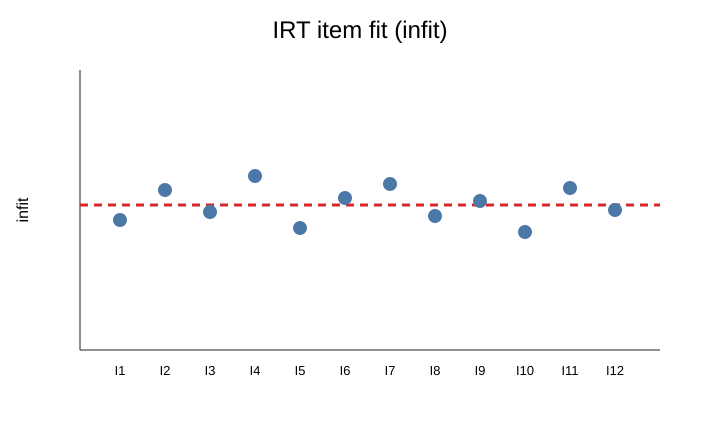

# Psychometrics and IRT with process data

`eyeprocesspy` treats eye-tracking and other process measures as **measurement evidence** that can be connected to psychometric models when the design justifies that connection. The package includes IRT foundations, fit and diagnostic tools, process-informed and dynamic models, DIF/DTF, score uncertainty, adaptive-testing helpers, multidimensional extensions, validation workflows, and scientific plots.

## Start from an explicit measurement question

Before selecting a model, define:

- the latent variable or trait being modeled;
- the item/response structure;
- the response scale and scoring rule;
- whether process variables are predictors, auxiliary measurements, outcomes, or part of a joint model;
- the level of each process feature (sample, fixation, AOI, trial, item, person, session);
- how missingness and exclusions are handled;
- what evidence would count as model adequacy or construct validity.

A large process-feature set is not itself a measurement model.

## Information and conditional precision

When an information profile is available:

```python
ax = ep.plot_eye_irt_information_profile(information)
ax.figure.tight_layout()
```


Conditional information and conditional SEM are useful because score precision varies across the latent continuum. A single global reliability coefficient cannot describe that heterogeneity.

## Item and person fit

```python
ax = ep.plot_eye_irt_item_fit(item_fit, statistic="infit")
ax.figure.tight_layout()
```



Fit statistics are diagnostics rather than automatic deletion rules. Investigate design, scoring, multidimensionality, local dependence, sparse exposure, and process evidence before removing items or participants.

## Local dependence and Q3-style diagnostics

The IRT diagnostic surface includes residual/local-dependence tools and Q3 matrices. If process features suggest shared stimulus structure, navigation dependencies, repeated content, or temporal carryover, residual dependence may be scientifically meaningful rather than merely a nuisance.

## DIF and differential test functioning

```python
ax = ep.plot_eye_irt_dif_curve(dif_curve)
ax.figure.tight_layout()
```


DIF analysis should separate statistical evidence from substantive interpretation. Group differences in item behavior can arise from construct-irrelevant barriers, true multidimensionality, differential familiarity, translation/presentation effects, sampling, or model misspecification.

## Process-informed IRT

Process features can be incorporated when the model and design make their role explicit. Examples include:

- item-level gaze or timing features as explanatory item covariates;
- person-level process summaries as auxiliary person predictors;
- trial-level process variables connected to response accuracy;
- joint response-time/process models;
- functional pupil representations linked to item/person parameters;
- dynamic process states or sequences used as structured auxiliary information.

Avoid assigning a psychological label to a feature merely because it predicts an IRT parameter.

## Dynamic and advanced process models

The package exposes dynamic/process families for workflows where behavior evolves across trials or measurement occasions. Use them only when the study can support the additional temporal/state assumptions. Report initialization, identification constraints, transition structure, priors/regularization, convergence diagnostics, and sensitivity analyses.

## Score uncertainty

Point estimates of `theta` should be accompanied by conditional uncertainty where possible. The plotting surface includes score-uncertainty displays, and the model utilities expose information/SEM and related diagnostics.

## Adaptive testing

Adaptive-testing functions can support item selection, information targeting, bank-coverage diagnostics, and traces of interim ability estimates. Operational CAT requires more than a working selection algorithm:

- calibrated and monitored item banks;
- exposure/content constraints;
- stopping-rule validation;
- fairness and DIF monitoring;
- security and item-drift controls;
- prospective simulation and operational validation.

The package's adaptive-testing governance article should be read before consequential use.

## Validation before substantive claims

For new or extended models, use the package's validation program:

- simulation/recovery;
- SBC-style evidence where appropriate;
- stress tests;
- negative controls;
- grouped/leakage-aware validation;
- robustness and sensitivity analyses;
- validation atlases/evidence objects.

A model that converges is not necessarily identified, calibrated, transportable, or substantively valid.

## Process features and leakage

When process variables are used for prediction or validation, split data at the scientifically independent unit. Trial-level rows from the same participant, item, stimulus, or session can create severe leakage if random row-wise splits are used.

Use grouped validation when the deployment/interpretation target requires generalization across participants, items, sessions, devices, or stimuli.

## Reporting checklist

For process-informed psychometrics, report:

1. response/scoring model;
2. item/person/sample structure;
3. process feature definitions and units;
4. feature extraction and aggregation level;
5. missingness and exclusions;
6. identification constraints;
7. estimation engine and version;
8. fit/local-dependence diagnostics;
9. score uncertainty;
10. DIF/fairness checks where relevant;
11. grouped validation strategy;
12. simulation/recovery or other validation evidence;
13. sensitivity analyses;
14. interpretation boundaries for process measures.

## Related material

- [Advanced model validation](../articles/advanced-model-validation.md)
- [Bayesian and 3PL process diagnostics](../articles/bayesian-and-3pl-process-diagnostics.md)
- [Adaptive testing governance](../articles/adaptive-testing-governance.md)
- [Visual gallery](../gallery.md)
- [Plotting reference](../reference/plotting.md)
