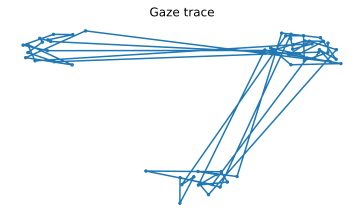
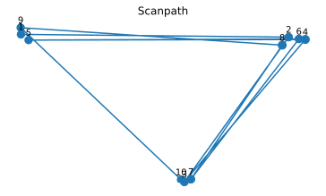
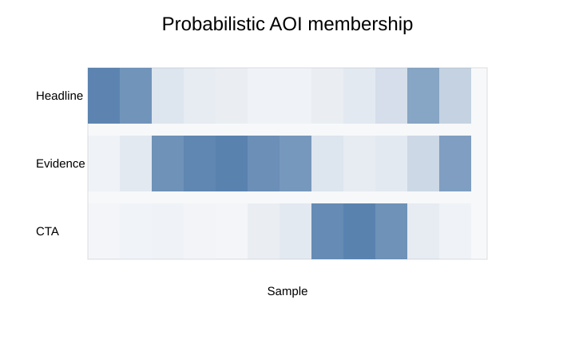
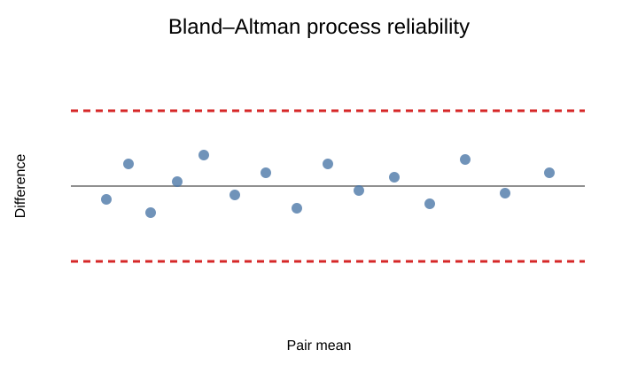

---
hide:
  - navigation
  - toc
---

<section class="ep-hero-v3">
  

    

      eyeprocesspy 0.1.0
      Stable · PyPI
    

    <h1>See the gaze process. Measure what changes.</h1>
    

      Vendor-neutral Python infrastructure for eye-tracking, pupillometry, AOIs,
      scanpaths, behavioral process measurement, psychometrics, uncertainty,
      validation, and reproducible research.
    

    

      <a class="md-button md-button--primary" href="getting-started/">Start in 5 minutes</a>
      <a class="md-button" href="guides/">Choose a workflow</a>
      <a class="ep-text-link" href="reference/">Browse the API →</a>
    

    

      <b>1,182 / 1,182</b> frozen APIs resolved
      <b>1,458</b> release tests
      <b>100%</b> statement + branch coverage
      <b>88 / 88</b> workflow articles linked
    

  

  

    

      

        
        <small>gaze process explorer</small>
      

      

        
      

      

        
<small>surface</small><strong>1,182 APIs</strong>

        
<small>workflows</small><strong>88 linked</strong>

        
<small>release gate</small><strong>100%</strong>

      

      
samples → events → process → evidence

    

  

</section>

  

    Install stable
    <code>pip install eyeprocesspy==0.1.0</code>
  

  

    <a href="https://pypi.org/project/eyeprocesspy/">PyPI</a>
    <a href="https://github.com/stefanosbalaskas/eyeprocesspy/releases/tag/v0.1.0">Release</a>
    <a href="https://doi.org/10.5281/zenodo.22285167">Zenodo</a>
  

<section class="ep-section-intro">
  01
  

    
Start from the research question

    <h2>Choose the workflow by what you need to establish.</h2>
    
Move from a substantive measurement question to an auditable workflow instead of starting from a function name.

  

</section>

  <a class="ep-question-card" href="guides/gazepoint-import-qc/">
    01
✓

    <h3>Can I trust the raw tracking?</h3>
    
Audit schema, timing, validity, missingness, screen bounds, coordinates, calibration context, and provenance before computing metrics.

    Import &amp; audit →
  </a>
  <a class="ep-question-card" href="guides/end-to-end-eye-tracking/">
    02
◎

    <h3>Where did gaze land?</h3>
    
Recover fixations, dwell, AOI occupancy, first-pass behavior, revisit structure, and spatial summaries without collapsing the process too early.

    Measure gaze →
  </a>
  <a class="ep-question-card" href="examples/core-workflow/">
    03
↗

    <h3>How did gaze move?</h3>
    
Inspect saccades, scanpaths, transitions, recurrence, entropy, sequence structure, and spatial-temporal trajectories.

    Model the process →
  </a>
  <a class="ep-question-card" href="guides/pupillometry/">
    04
◉

    <h3>What changed in pupil?</h3>
    
Prepare eye-specific pupil streams, baseline-correct transparently, quantify missingness, and connect temporal pupil measures to events.

    Open pupillometry →
  </a>
  <a class="ep-question-card" href="examples/process-reliability/">
    05
≈

    <h3>Are process measures reliable?</h3>
    
Quantify agreement, repeatability, measurement stability, uncertainty, and sensitivity before interpreting individual or condition differences.

    Inspect reliability →
  </a>
  <a class="ep-question-card" href="guides/psychometrics-irt/">
    06
θ

    <h3>How should process evidence enter models?</h3>
    
Connect process measures to psychometrics, IRT, information, DIF/DTF, uncertainty, diagnostics, and model-ready analysis objects.

    Open measurement models →
  </a>

  
Need the complete scientific map?<strong>Use the guide hub to move from question → assumptions → workflow → evidence.</strong>

  <a class="md-button" href="guides/">Open guide map</a>

<section class="ep-section-intro">
  02
  

    
A defensible measurement chain

    <h2>From raw exports to a reportable result.</h2>
    
Every stage preserves enough information to inspect the assumptions made at the next one.

  

</section>

  
<b>01</b><strong>Import</strong>vendor · generic · schema
<i>→</i>
  
<b>02</b><strong>Audit</strong>timing · validity · missingness
<i>→</i>
  
<b>03</b><strong>Prepare</strong>coordinates · events · pupil
<i>→</i>
  
<b>04</b><strong>Measure</strong>fixations · AOIs · scanpaths
<i>→</i>
  
<b>05</b><strong>Model</strong>reliability · IRT · uncertainty
<i>→</i>
  
<b>06</b><strong>Report</strong>plots · provenance · evidence

  

    <h3>A broad API, composed into one governed workflow</h3>
    
Start with the bundled benchmark, validate the installation and data surface, then move into study-specific imports and analysis.

    <a class="ep-inline-arrow" href="getting-started/">Quickstart →</a>
  

  
<pre><code class="language-python">import eyeprocesspy as ep

study = ep.eyeprocess_benchmark_study()
audit = ep.validate_benchmark_study(study)
data = ep.import_benchmark_study(study)

assert audit["valid"]

# Continue with gaze, AOI, pupil,
# process, reliability, and model workflows.</code></pre>

<section class="ep-section-intro">
  03
  

    
See the process

    <h2>Visual outputs that stay connected to the method.</h2>
    
Use plots as analytical summaries and diagnostics, not decoration. The gallery exposes trajectories, uncertainty, temporal structure, and reliability.

  

</section>

  <a href="gallery/" class="ep-plot-tile ep-plot-tile--wide"><b>Canonical gaze trace</b><small>Inspect validity-aware spatial process structure</small></a>
  <a href="gallery/" class="ep-plot-tile"><b>Scanpaths</b><small>Follow fixation order and movement structure</small></a>
  <a href="gallery/" class="ep-plot-tile"><b>Probabilistic AOIs</b><small>Keep coordinate uncertainty visible at boundaries</small></a>
  <a href="gallery/" class="ep-plot-tile ep-plot-tile--wide"><b>Process reliability</b><small>Inspect repeatability and agreement evidence</small></a>

<a class="md-button" href="gallery/">Explore the complete plot gallery</a>

<section class="ep-section-intro">
  04
  

    
Evidence, not just features

    <h2>Built around an explicit scientific validation record.</h2>
    
The Python implementation is tied to a frozen R reference and exposes release evidence, translation boundaries, and reproducibility state instead of hiding them.

  

</section>

  

    Parity-first implementation
    <h3>Frozen reference. Audited translation. Python-native workflows.</h3>
    
<code>eyeprocesspy</code> retains the frozen <strong>eyeprocess R 0.11.1</strong> scientific reference while exposing a native Python surface across eye tracking, pupil, AOIs, process measurement, psychometrics, validation, and reporting.

    
<a href="parity-and-validation/">Parity &amp; validation →</a><a href="release-and-reproducibility/">Reproducibility →</a><a href="articles/">88 workflow articles →</a>

  

  

    
<strong>1,182 / 1,182</strong>frozen APIs resolved

    
<strong>1,458</strong>release tests passed

    
<strong>100% + 100%</strong>statements + branches

    
<strong>12 lanes</strong>3 OS × Python 3.11–3.14

  

  
R→Py<h3>Coming from eyeprocess in R?</h3>
Use the parity record to understand the frozen reference, resolved API surface, scientific checks, and deliberate Python translation boundaries.
<a href="parity-and-validation/">Open the R → Python evidence →</a>

  
API<h3>Already know the method?</h3>
Jump directly to the reference map and inspect the complete API, plotting surface, signatures, parameters, and implementation notes.
<a href="reference/">Browse the API reference →</a>

<section class="ep-guardrail-v3">
  
!

  
Interpretation boundary<h2>Gaze structure is not a psychological state.</h2>
Reliability is not construct validity, prediction is not causation, probabilistic AOI membership represents modeled coordinate uncertainty rather than probability of attention, and gaze or pupil measures do not independently establish cognition, emotion, intention, comprehension, diagnosis, or causal effects.

</section>

<section class="ep-final-cta">
  
Ready to run the pipeline?<h2>Start with the benchmark. Keep every decision visible.</h2>
Install 0.1.0, validate the known-good benchmark surface, then move into the workflow that matches your research question.

  
<a class="md-button md-button--primary" href="getting-started/">Open quickstart</a><a class="md-button" href="examples/">See worked examples</a>

</section>

