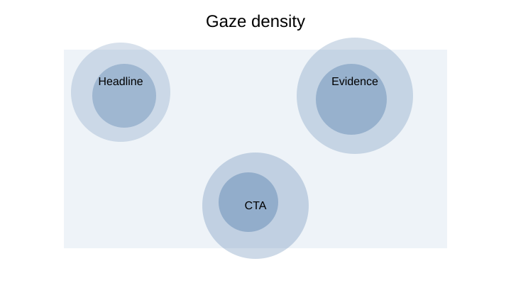
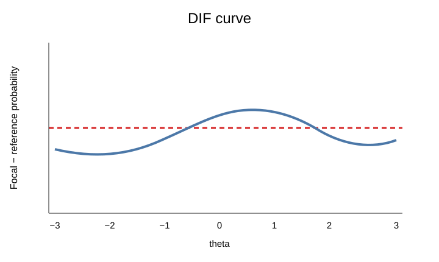

# Plotting reference

`eyeprocesspy` exposes a broad Matplotlib plotting surface across core eye-tracking, pupil/biometric streams, process quality, psychometrics/IRT, validation, governance, and advanced model families.

Most plotting helpers return a **Matplotlib `Axes`** object. Core plotting functions also attach their underlying plotted data to `ax.eyeprocess_plot_data`; matrix-like displays can additionally attach `ax.eyeprocess_plot_matrix`.

## Basic pattern

```python
import eyeprocesspy as ep

ax = ep.plot_eye_trace(eye, trial_id="T1")
ax.figure.tight_layout()
ax.figure.savefig("gaze-trace.svg", bbox_inches="tight")
```

Because the result is an ordinary Matplotlib axis, normal Matplotlib methods remain available for labels, titles, annotations, sizing, export, and multi-panel composition.

## Core eye-tracking plots

| Function | Primary use |
| --- | --- |
| `plot_eye_overview()` | Canonical dataset component counts |
| `plot_eye_trace()` | Ordered gaze path |
| `plot_fixations()` | Fixation centroids and duration-scaled markers |
| `plot_scanpath()` | Ordered AOI visits/fixations |
| `plot_gaze_heatmap()` | 2-D gaze-density histogram |
| `plot_aoi_dwell()` | AOI dwell summaries |
| `plot_transition_matrix()` | AOI transition structure |
| `plot_pupil_timeseries()` | Pupil observations over time |
| `plot_biometrics()` | Biometric channels on a shared time axis |
| `plot_signal_quality()` | Signal-quality metrics |
| `plot_sampling_rate()` | Empirical/effective gaze sampling rate |
| `plot_clock_alignment()` | Clock/timebase diagnostics |
| `plot_coordinate_spaces()` | Coordinate-space diagnostics |
| `plot_missingness()` | Missing-data summaries |
| `plot_trial_timeline()` | Trial/event timing |
| `plot_feature_distribution()` | Derived feature distributions |
| `plot_feature_correlation()` | Feature relationship matrix |
| `plot_item_difficulty()` | Item-difficulty summaries |
| `plot_model_diagnostics()` | Model diagnostic surface |

## Spatial examples

```python
ax = ep.plot_gaze_heatmap(
    eye,
    trial_id="T1",
    bins=(40, 30),
)
```



```python
ax = ep.plot_scanpath(eye, trial_id="T1")
```


## Pupil example

```python
ax = ep.plot_pupil_timeseries(
    eye,
    trial_id="T1",
    eye="L",
)
```


## Process-quality plots

| Function | Use |
| --- | --- |
| `plot_eye_process_reliability_profile()` | Reliability/Bland–Altman evidence |
| `plot_eye_calibration_error_model()` | Empirical calibration-error cloud |
| `plot_eye_calibration_drift_profile()` | Calibration drift across sessions/groups |
| `plot_eye_data_quality_profile()` | Quality metrics across units |
| `plot_eye_probabilistic_aoi_assignment()` | AOI membership probabilities |
| `plot_eye_sampling_irregularity_audit()` | Timestamp irregularity diagnostics |

```python
profile = ep.process_reliability_profile(
    repeated,
    person="person",
    session="session",
    measure="dwell_score",
)
ax = ep.plot_eye_process_reliability_profile(profile)
```


## IRT and psychometric plots

The IRT surface includes explicit plot functions instead of relying on R-style S3 dispatch.

Representative functions include:

- `plot_eye_irt_information_profile()`;
- `plot_eye_irt_test_characteristic_curve()`;
- `plot_eye_irt_identification_audit()`;
- `plot_eye_irt_sparse_design_audit()`;
- `plot_eye_irt_q3_matrix()`;
- `plot_eye_irt_item_fit()`;
- `plot_eye_irt_person_fit()`;
- `plot_eye_irt_fit_dashboard()`;
- `plot_eye_irt_score_uncertainty()`;
- `plot_eye_irt_adaptive_trace()`;
- `plot_eye_irt_link_stability()`;
- `plot_eye_irt_dif_curve()`;
- `plot_eye_irt_dtf_curve()`;
- `plot_eye_irt_process_alignment()`;
- `plot_eye_irt_recovery_result()`;
- `plot_eye_irt_sbc_evidence()`;
- `plot_eye_cdm_qmatrix_audit()`;
- `plot_eye_irt_bank_coverage()`;
- `plot_eye_irt_targeting_gap()`;
- `plot_eye_irt_missing_design_audit()`;
- `plot_eye_irt_prior_sensitivity()`.




## Access the plotted data

For core plots:

```python
ax = ep.plot_transition_matrix(eye)
plotted = ax.eyeprocess_plot_data
matrix = ax.eyeprocess_plot_matrix
```

This allows a figure to remain auditable: the visual output and the exact data used to draw it can be retained together.

## Reuse an existing axis

```python
import matplotlib.pyplot as plt

fig, ax = plt.subplots(figsize=(8, 5))
ep.plot_eye_trace(eye, trial_id="T1", ax=ax)
fig.tight_layout()
```

Passing an axis is useful for manuscript panels and custom figure layouts.

## Export publication figures

```python
ax = ep.plot_eye_irt_information_profile(information)
ax.figure.set_size_inches(7, 4.5)
ax.figure.tight_layout()
ax.figure.savefig("irt-information.pdf", bbox_inches="tight")
ax.figure.savefig("irt-information.svg", bbox_inches="tight")
ax.figure.savefig("irt-information.png", dpi=300, bbox_inches="tight")
```

Vector formats such as SVG/PDF are useful for line art and text-heavy diagnostics; high-resolution PNG is useful when rasterized heatmaps or journal systems require it.

## Missing Matplotlib

Core plotting helpers lazy-load Matplotlib. If plotting dependencies are unavailable, install them explicitly:

```bash
python -m pip install "matplotlib>=3.9"
```

Some specialist plotting/model families can require additional optional scientific backends.

## Reproduce the gallery

```bash
python examples/core_gallery.py
python examples/advanced_gallery.py
```

These deterministic scripts generate the visual examples used throughout the documentation without requiring private research data.

[Open the 15-figure gallery](../gallery.md){ .md-button .md-button--primary }
[Runnable examples](../examples/index.md){ .md-button }
